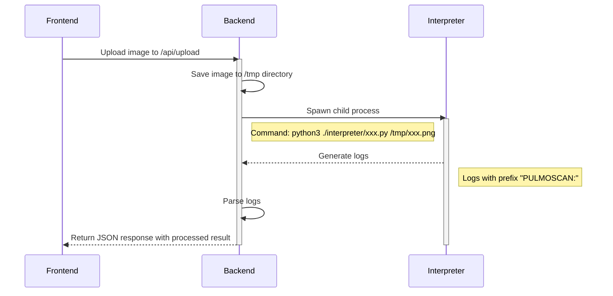

# Pulmoscan

Detection of lung disease: Normal, Pneumonia, Tuberculosis or Covid-19?

## How it Works



## Requirements

- [Python](https://www.python.org/) 3.10.x
- [Node.js](https://nodejs.org/en) 20.x (lts/iron) with npm
- [pnpm](https://pnpm.io/) (optional but recommended)
- [pm2](https://pm2.keymetrics.io/) (production)

## Getting Started

1. Clone this repository

   ```bash
   git clone https://github.com/sooluh/pulmoscan.git
   ```

2. Install dependencies

   - Python

     ```bash
     pip3 install -r requirements.txt
     ```

   - Node.js

     ```bash
     pnpm install
     ```

3. Run locally

   - Development mode

     ```bash
     pnpm dev
     ```

   - Production mode

     1. Build first

        ```bash
        pnpm build
        ```

     2. Start the app

        ```bash
        node -r dotenv/config build
        ```

        Using `pm2`?

        ```bash
        pm2 start node --name pulmoscan -- -r dotenv/config build
        ```

## Data Source

- https://www.kaggle.com/datasets/paultimothymooney/chest-xray-pneumonia
- https://www.kaggle.com/datasets/samuel156/lungxrays-grayscale
